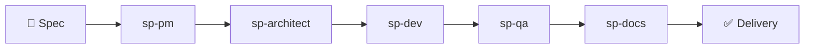

# Stackpilot

[](https://github.com/9aoyang/stackpilot/actions/workflows/ci.yml)
[](LICENSE)
[](https://github.com/9aoyang/stackpilot/releases)

**English** | [中文](#中文文档)

Autonomous AI development team. Write a spec, get production-ready code — with tests, docs, and code review. Works with Claude Code, Codex, Gemini CLI, or any LLM CLI.



## Why Stackpilot

Without Stackpilot, shipping a feature with AI means:
- Manually prompt the model → copy output → create tasks by hand
- Run each step yourself → check results → re-prompt for fixes
- Context is lost between sessions; no one tracks what's done

With Stackpilot:

```bash
# Write a spec and commit it — that's all you do
echo "# Add JWT auth\n\n..." > .stackpilot/specs/2026-04-05-jwt-auth.md
git add . && git commit -m "spec: add JWT auth"

# ↑ This single commit triggers the full pipeline automatically:
# sp-pm decomposes tasks → sp-architect reviews design
# → sp-dev implements → sp-qa writes tests → sp-docs updates docs
```

Agents run headlessly via git hooks. You review results in `NEEDS_REVIEW.md`.

## Demo

```
$ git commit -m "spec: add user search feature"
[stackpilot] New spec detected: .stackpilot/specs/2026-04-05-user-search.md
[stackpilot] Dispatching sp-pm...

  sp-pm → Created 4 tasks in .stackpilot/tasks/backlog.yml
    TASK-001: Design search API schema          [pending]
    TASK-002: Implement /users/search endpoint  [pending]
    TASK-003: Write integration tests           [pending]
    TASK-004: Update API docs                   [pending]

$ git checkout -b feat/user-search
[stackpilot] Branch switched — running Coordinator...
[stackpilot] Dispatching sp-architect for TASK-001...
[stackpilot] Dispatching sp-dev for TASK-002...

  ✓ TASK-001 complete — arch review in .stackpilot/tasks/arch-review/
  ✓ TASK-002 complete — implementation committed
  ! TASK-003 needs review → see .stackpilot/tasks/NEEDS_REVIEW.md
```

See [examples/specs/](examples/specs/) for real spec examples.

## Install

```bash
curl -fsSL https://raw.githubusercontent.com/9aoyang/stackpilot/main/install.sh | bash
```

Installs Stackpilot and all dependencies. Requires git and at least one AI CLI (Claude Code, Codex, Gemini CLI, or a custom tool).

## Usage

**Claude Code:**

| Command | Description |
|---------|-------------|
| `/stackpilot` | Main entry point — init, brainstorming, planning, and delivery. Shows sprint status, guides next action. |
| `/stackpilot:auto` | Full-auto mode — same workflow but skips all confirmations. Ends with code on feature branch ready for review. |
| `/stackpilot:sync` | Manage external skill references inlined into agents. `add` to extract a new skill, `check` to detect updates. |
| `/stackpilot:compete` | Competitive gap analysis — assume persona of a competing product's power user and identify what would make them switch. |

**Other providers:** Run `bash ~/.stackpilot/scripts/init.sh` in your project, then set the provider in `stackpilot.config.yml`.

## Config

```yaml
# stackpilot.config.yml
provider:
  name: claude             # claude | codex | gemini | custom
  # model: ~               # Override model (optional)
  # command: ~             # Required when name=custom

qa:
  coverage_threshold: 80
  test_command: npm test    # pytest / go test ./... / cargo test
coordinator:
  timeout_hours: 2
```

### Supported Providers

| Provider | CLI | Notes |
|----------|-----|-------|
| `claude` | [Claude Code](https://docs.anthropic.com/en/docs/claude-code) | Default. Full feature support (tool restrictions, skills, plugins) |
| `codex` | [Codex CLI](https://github.com/openai/codex) | Uses `--full-auto` mode |
| `gemini` | [Gemini CLI](https://github.com/google-gemini/gemini-cli) | Uses `-p` prompt mode |
| `custom` | Any CLI | Set `provider.command` to your tool's invocation |

## Architecture

See [docs/architecture.md](docs/architecture.md) for the full system design, agent pipeline, event flow, and task lifecycle.

## [Contributing](CONTRIBUTING.md) | [License](LICENSE)

---

<a id="中文文档"></a>

# 中文文档

[](https://github.com/9aoyang/stackpilot/actions/workflows/ci.yml)
[](LICENSE)
[](https://github.com/9aoyang/stackpilot/releases)

**[English](#stackpilot)** | 中文

自治 AI 开发团队。写设计文档，交付生产级代码 — 含测试、文档和代码审查。支持 Claude Code、Codex、Gemini CLI 或任意 LLM CLI。


## 为什么选 Stackpilot

没有 Stackpilot，用 AI 交付功能意味着：
- 手动提示模型 → 复制输出 → 手动拆任务
- 亲自跑每个步骤 → 看结果 → 再补充提示修复
- 会话间上下文丢失，没有人追踪进度

有了 Stackpilot：

```bash
# 写一个设计文档并提交 — 这就是你要做的全部
echo "# 增加 JWT 认证\n\n..." > .stackpilot/specs/2026-04-05-jwt-auth.md
git add . && git commit -m "spec: add JWT auth"

# ↑ 这次提交自动触发完整流水线：
# sp-pm 拆解任务 → sp-architect 评审设计
# → sp-dev 实现 → sp-qa 写测试 → sp-docs 更新文档
```

Agents 通过 git hooks 无人值守运行。你只需查看 `NEEDS_REVIEW.md` 审批关键决策。

## 演示

```
$ git commit -m "spec: 增加用户搜索功能"
[stackpilot] 检测到新 spec: .stackpilot/specs/2026-04-05-user-search.md
[stackpilot] 正在派发 sp-pm...

  sp-pm → 在 .stackpilot/tasks/backlog.yml 中创建了 4 个任务
    TASK-001: 设计搜索 API schema          [pending]
    TASK-002: 实现 /users/search 接口       [pending]
    TASK-003: 编写集成测试                  [pending]
    TASK-004: 更新 API 文档                 [pending]

$ git checkout -b feat/user-search
[stackpilot] 分支切换 — 正在运行 Coordinator...
[stackpilot] 派发 sp-architect 处理 TASK-001...
[stackpilot] 派发 sp-dev 处理 TASK-002...

  ✓ TASK-001 完成 — 架构评审在 .stackpilot/tasks/arch-review/
  ✓ TASK-002 完成 — 实现已提交
  ! TASK-003 需要审批 → 查看 .stackpilot/tasks/NEEDS_REVIEW.md
```

真实 spec 示例见 [examples/specs/](examples/specs/)。

## 安装

```bash
curl -fsSL https://raw.githubusercontent.com/9aoyang/stackpilot/main/install.sh | bash
```

自动安装 Stackpilot 及所有依赖。需要 git 和至少一个 AI CLI（Claude Code、Codex、Gemini CLI 或自定义工具）。

## 使用

**Claude Code:**

| 命令 | 说明 |
|------|------|
| `/stackpilot` | 主入口 — 初始化、头脑风暴、规划、交付。显示 sprint 状态，引导下一步操作。 |
| `/stackpilot:auto` | 全自动模式 — 跳过所有确认环节，代码直接提交到功能分支等待审查。 |
| `/stackpilot:sync` | 管理外部技能引用。`add` 提取新技能，`check` 检测已引用技能的更新。 |
| `/stackpilot:compete` | 竞品差距分析 — 以竞品重度用户视角，找出让用户转向的关键因素。 |

**其他 Provider:** 在项目中运行 `bash ~/.stackpilot/scripts/init.sh`，然后在 `stackpilot.config.yml` 中设置 provider。

## 配置

```yaml
# stackpilot.config.yml
provider:
  name: claude             # claude | codex | gemini | custom
  # model: ~               # 覆盖模型（可选）
  # command: ~             # name=custom 时必填

qa:
  coverage_threshold: 80
  test_command: npm test    # pytest / go test ./... / cargo test
coordinator:
  timeout_hours: 2
```

### 支持的 Provider

| Provider | CLI | 说明 |
|----------|-----|------|
| `claude` | [Claude Code](https://docs.anthropic.com/en/docs/claude-code) | 默认。完整功能支持（工具限制、技能、插件） |
| `codex` | [Codex CLI](https://github.com/openai/codex) | 使用 `--full-auto` 模式 |
| `gemini` | [Gemini CLI](https://github.com/google-gemini/gemini-cli) | 使用 `-p` 提示模式 |
| `custom` | 任意 CLI | 设置 `provider.command` 为你的工具命令 |

## 架构文档

完整的系统设计、Agent 流水线、事件流和任务生命周期，见 [docs/architecture.zh.md](docs/architecture.zh.md)。

## [贡献指南](CONTRIBUTING.md) | [许可证](LICENSE)
